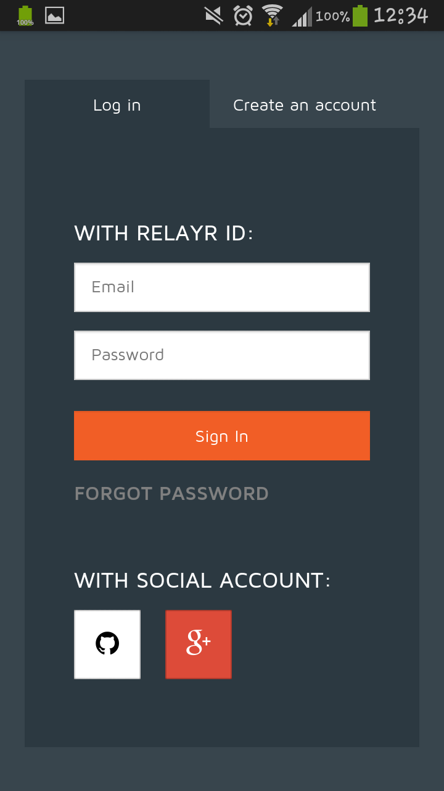
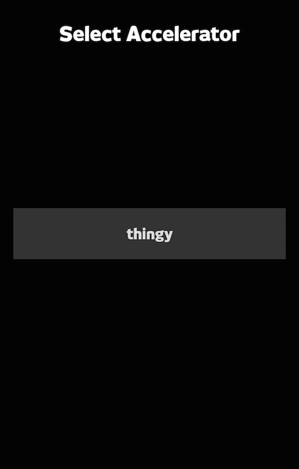
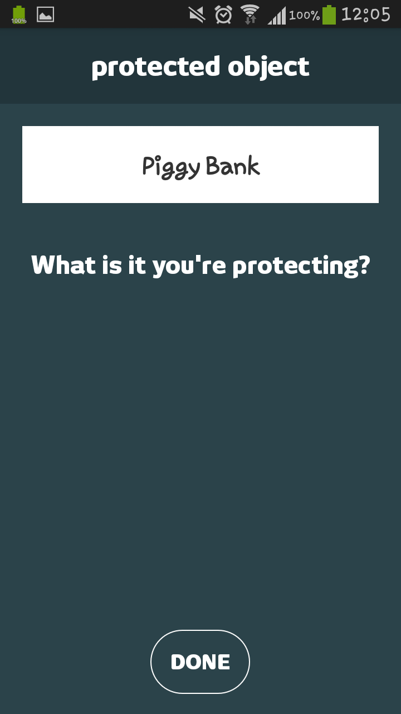
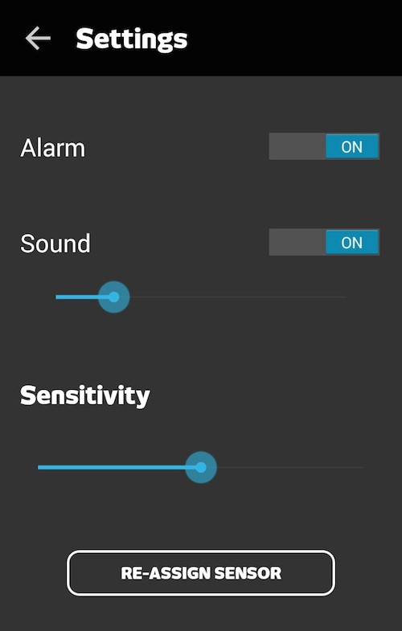
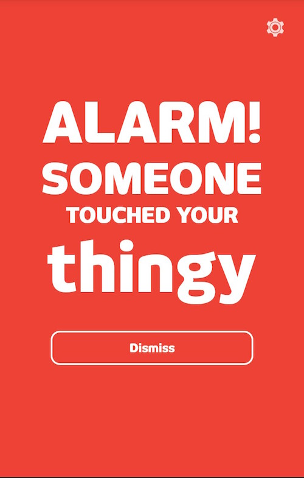

# The Can'tTouchThis Demo Application

Can’tTouchThis is a quick and fun application which uses the Wunderbar Accelerometer/Gyroscope sensor and the relayr Cloud Platform to alert when your wallet/keys/cello/elephant has been touched, stolen or moved. It will also give you an idea as to how to implement the [relayr Android SDK](https://github.com/relayr/android-sdk) in order to create your very own application. 

Simply place your sensor on the item you wish to monitor and show people that they Can’t Touch This!

To download the app and try it out simply click [here](https://play.google.com/store/apps/details?id=com.relayr.cannottouchthis)

#### 1. Sign in
Start by signing in with your relayr credentials or use your Google+ / GitHub credentials to sign in.

#### 2. Select your sensor
**Note**: in the debug mode of the application there will only be one available sensor for selection.

#### 3. Give your object a name
Name the object you would like to protect and click *Done*.

#### 4. Your object in now safe! 

#### 5. Modify the settings
Use the sliders to adjust the sensitivity of the alert mechanism as well as the volume of the sound triggered.
 
**Note**: In debug mode the alarm will be triggered every ~25 seconds.

#### 6. Get alerted
When the alarm is triggered you will be prompted with the following screen
The screen will pop up even when the application is in the background.

